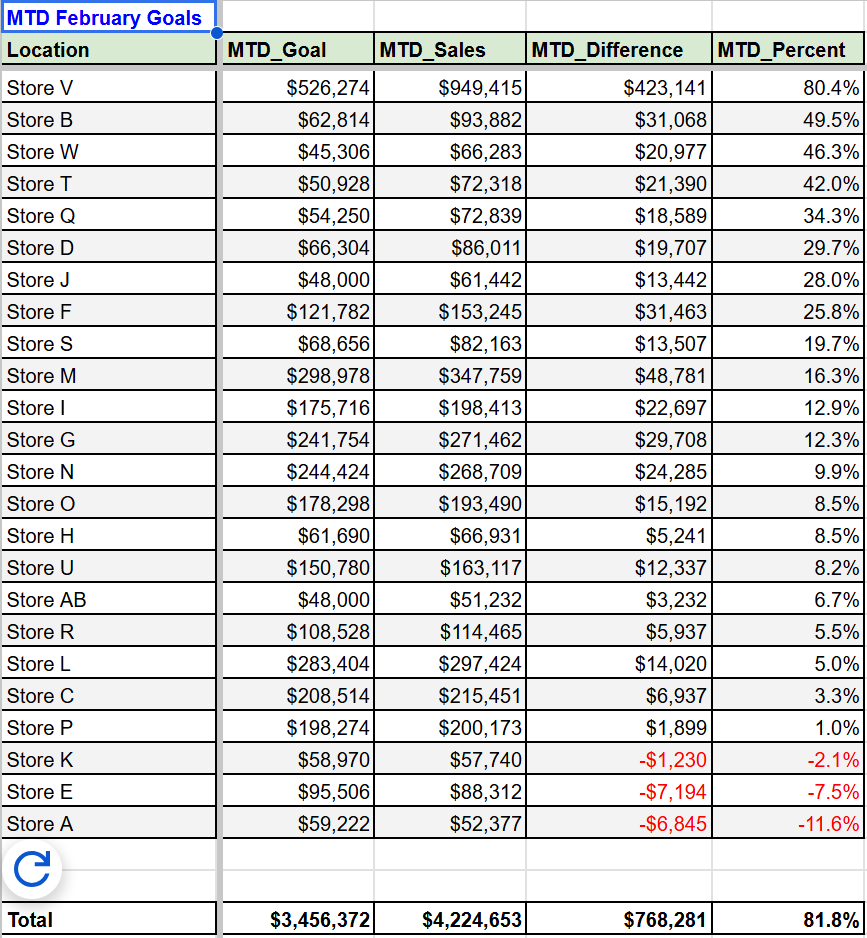

# MTD-Sales-Goals-Report

<br>

## Overview
The MTD Sales Goals report compares each store's month-to-date sales against it's sales goals. This report can be used to identify both over and underperforming stores, investigate the drivers influencing performance, and uncover opportunities for improvement. Data was stored in BigQuery and connected to Google Sheets for convenient manager access. 

<br>
<br>

## Dataset

Two tables were joined together to create this report. The **Daily_Store_Goals-Feb2026** table, and the **Store_Item_Sales-Feb2026** table. Each tables details are shown below.


**Daily_Store_Goals-Feb2026**
* Data: Each stores daily sales goal in February 2026
* Number of Rows: 700

**Schema:**

img

<br>

**Store_Item_Sales-Feb2026**
* Data: All item-level sales for all stores in February 2026
* Number of Rows: 51k

**Schema:**

img

<br>

### SQL Query Used
```SQL
-- Gathers all daily goals data from the goals table.
WITH
daily_goals AS (
  SELECT
    CAST(date AS DATE) AS date,
    Location,
    Goal
  FROM jacobperovichportfolio.goals
),


-- Aggregates total sales per store and day while filtering out bag fees and gift card sales.
net_sales_per_store AS (
  SELECT
    Date,
    Location,    
    ROUND(SUM(Net_sales), 2) AS Net_Sales
  FROM jacobperovichportfolio.sales
  WHERE
    LOWER(product_name) NOT IN('bag_fee', 'gift_card')
  GROUP BY Date, Location
),


-- Daily goals data is joined to the aggregated daily sales table.
combined AS (
  SELECT
    g.Date,
    g.Location,
    COALESCE(g.goal, 0) AS Daily_Goal,
    COALESCE(ns.Net_Sales, 0) AS Net_Sales
  FROM daily_goals g
  LEFT JOIN net_sales_per_store ns
    ON g.date = ns.date
    AND g.location = ns.location
  WHERE
    g.date BETWEEN '2025-01-01' AND CURRENT_DATE - INTERVAL 1 day
    -- Updates to this report were made once at the start of a new day. In order to show the correct MTD goal amount for each store, the total goal
       needed to be calculated only up to the prior day.
),


-- Aggregates daily store data to MTD (one row per store).
mtd_summary AS (
  SELECT
    Location,
    SUM(Daily_Goal) AS MTD_Goal,
    ROUND(SUM(Net_Sales), 2) AS MTD_Sales,
    ROUND(SUM(Net_Sales) - SUM(Daily_Goal), 2) AS MTD_Difference
  FROM combined
  GROUP BY Location
)


SELECT
  Location,
  MTD_Goal,
  MTD_Sales,
  MTD_Difference,
  ROUND(MTD_Difference / NULLIF(MTD_Goal, 0), 4) AS MTD_Percent
FROM mtd_summary
WHERE
  Location <> 'Store Z'
ORDER BY MTD_Percent DESC;

```
<br>

## Output MTD Sales Goals Report


