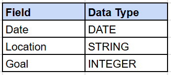
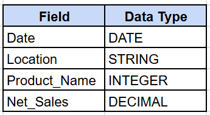
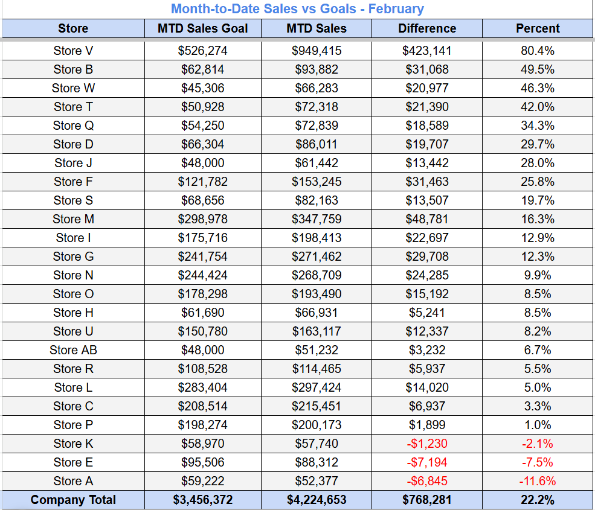

## Overview
The MTD Sales Goals report compares each store's month-to-date sales against it's sales goals. This report can be used to identify both over and underperforming stores, investigate the drivers influencing performance, and uncover opportunities for improvement. Data was stored in BigQuery and connected to Google Sheets for convenient manager access. 

<br>

## Dataset

Two tables were joined together to create this report. The **"Daily_Store_Goals"** table, and the **"Store_Item_Sales"** table. Each tables details are shown below.

<br>

**Table 1: Daily_Store_Goals**
* **Data:** Each stores daily sales goal in February 2026
* **Number of Rows:** 700

**Schema:**



<br>

**Table 2: Store_Item_Sales**
* **Data:** All item-level sales of all stores in February 2026
* **Number of Rows:** 51k

**Schema:**



<br>

## SQL Query Used
```SQL
-- Gathers all stores daily sales goals from the "Daily_Store_Goals" table.
WITH
daily_goals AS (
  SELECT
    CAST(date AS DATE) AS date,
    TRIM(Location) AS Store,
    Goal
  FROM Portfolio_Data.Daily_Store_Goals
),

-- Aggregates total sales per store and day while excluding bag fees and gift card sales.
sales_per_store AS (
  SELECT
    Date,
    TRIM(Location) AS Store,    
    ROUND(SUM(Net_sales), 2) AS Net_Sales
  FROM Portfolio_Data.Store_Item_Sales
  WHERE
    LOWER(product_name) <> 'bag_fee' AND LOWER(product_name) <> 'gift_card'
  GROUP BY Date, Location
),

-- Daily goals are joined with the aggregated daily sales data.
combined AS (
  SELECT
    g.Date,
    g.Store,
    COALESCE(g.goal, 0) AS Sales_Goal,
    COALESCE(s.Net_Sales, 0) AS Net_Sales
  FROM daily_goals g
  LEFT JOIN sales_per_store s
    ON g.Date = s.Date
    AND g.Store = s.Store
  WHERE
    g.Date <= (select MAX(date) from sales_per_store)
    -- This report was updated at the start of each day. In order to show the correct MTD goal for each store, the total goal was calculated up to the prior day to match the date the sales table was updated to.
),

-- Aggregates daily store data to MTD (one row per store).
mtd_summary AS (
  SELECT
    Store,
    SUM(Sales_Goal) AS `MTD Sales Goal`,
    ROUND(SUM(Net_Sales), 2) AS `MTD Sales`,
    ROUND(SUM(Net_Sales) - SUM(Sales_Goal), 2) AS Difference
  FROM combined
  GROUP BY ROLLUP(Store)
)

SELECT
   COALESCE(Store, 'Company Total') AS Store,
  `MTD Sales Goal`,
  `MTD Sales`,
  Difference,
  ROUND(Difference / NULLIF(`MTD Sales Goal`, 0), 4) AS Percent
FROM mtd_summary
ORDER BY 
  CASE WHEN Store = 'Company Total' THEN 1 ELSE 0 END,
  Percent DESC;

```
<br>

## Output MTD Sales Goals Report


